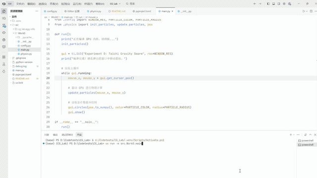

# Work0 万有引力粒子群仿真程序

## 项目架构

本项目是一个基于 Taichi 库的万有引力粒子群仿真程序，项目结构如下：

```
CG_Lab/
├── src/
│   └── Work0/
│       ├── __init__.py
│       ├── config.py      # 配置文件，定义物理和渲染参数
│       ├── main.py        # 主程序，负责初始化和渲染
│       |── physics.py     # 物理计算核心，实现粒子运动和引力计算
|       └── README.md      #说明文档
├── .gitignore
├── .python-version
├── README.md
├── main.py
├── pyproject.toml         # 项目配置和依赖管理
└── uv.lock
```

## 代码逻辑

1. **初始化阶段**：
   - 在 `main.py` 中，首先通过 `ti.init(arch=ti.gpu)` 初始化 Taichi 并指定使用 GPU 架构
   - 调用 `init_particles()` 函数在 GPU 显存中初始化粒子的随机位置

2. **物理计算**：
   - `physics.py` 中的 `update_particles()` 函数是核心计算部分，由 GPU 并行执行
   - 对每个粒子，计算其与鼠标位置的距离和方向
   - 根据距离施加引力（距离大于 0.05 时）
   - 应用空气阻力和边界碰撞检测

3. **渲染循环**：
   - 在 `main.py` 的 `run()` 函数中，创建 GUI 窗口
   - 进入主循环，不断获取鼠标位置并更新粒子状态
   - 使用 `gui.circles()` 绘制粒子
   - 调用 `gui.show()` 显示帧

## 结果演示

<div align="center">
  
</div>

## 实现功能

- **GPU 并行计算**：利用 Taichi 库的 `@ti.kernel` 装饰器，将物理计算部分在 GPU 上并行执行，大大提高计算效率
- **鼠标交互**：粒子会受到鼠标位置的引力影响，跟随鼠标移动
- **边界碰撞**：粒子碰到窗口边界时会反弹
- **实时渲染**：实时显示粒子的运动状态，提供直观的视觉效果

## 运行说明

1. **安装依赖**：
   ```bash
   uv install
   ```

2. **运行程序**：
   ```bash
   uv run -m src.Work0.main
   ```

3. **交互方式**：
   - 在弹出的窗口中移动鼠标，观察粒子的运动轨迹
   - 粒子会受到鼠标的引力作用，聚集到鼠标附近

## 配置参数

在 `config.py` 文件中可以调整以下参数：

- `NUM_PARTICLES`：粒子总数，默认 10000（卡顿请调小此数值）
- `GRAVITY_STRENGTH`：鼠标引力强度，默认 0.001
- `DRAG_COEF`：空气阻力系数，默认 0.98
- `BOUNCE_COEF`：边界反弹能量损耗，默认 -0.8
- `WINDOW_RES`：窗口分辨率，默认 (800, 600)
- `PARTICLE_RADIUS`：粒子绘制半径，默认 1.5
- `PARTICLE_COLOR`：粒子颜色，默认 0x00BFFF（天蓝色）

## 技术栈

- Python 3.13+
- Taichi 1.7.4+（用于 GPU 并行计算）


