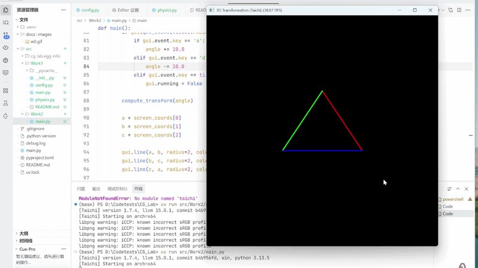
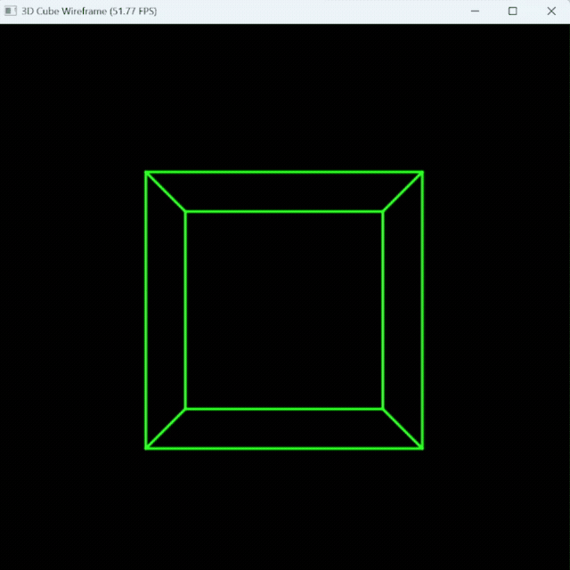

# 3D 变换与旋转插值实验

基于 Taichi 框架实现的计算机图形学实验，包含两个主要任务。

## 任务一：MVP 矩阵变换

### 功能说明

实现三角形的 MVP（Model-View-Projection）矩阵变换，并在 Taichi 的 GUI 窗口中绘制出对应的线框三角形。


### 文件位置

`task1.py`


### MVP 矩阵变换

- **Model Matrix（模型矩阵）**：实现绕 Z 轴的旋转变换
- **View Matrix（视图矩阵）**：设置相机位置 `[0, 0, 5]`，实现视角变换
- **Projection Matrix（投影矩阵）**：标准透视投影（fovy=45°）


### 交互控制

- **A 键**：顺时针旋转三角形
- **D 键**：逆时针旋转三角形
- **ESC 键**：退出程序

### 效果展示

三角形三个顶点使用不同颜色：
- 红色：顶点 A
- 绿色：顶点 B
- 蓝色：顶点 C

<div align="center">
  
</div>


## 任务二：3D 立方体透视旋转

### 文件位置

`task2_y.py`

### 实现原理

在任务一基础上实现 3D 线框立方体的透视投影和绕 Y 轴旋转。立方体由 8 个顶点和 12 条边组成，通过 MVP 矩阵变换将 3D 坐标投影到 2D 屏幕。

- **模型矩阵**：绕 Y 轴旋转
- **视图矩阵**：相机位置 `[0, 0, 6]`
- **投影矩阵**：标准透视投影（fovy=45°）

3D立方体构建：


```python
# 8 个顶点（中心在原点，边长为 2）
v_list = [
    [-1, -1, -1], [ 1, -1, -1], [ 1,  1, -1], [-1,  1, -1],
    [-1, -1,  1], [ 1, -1,  1], [ 1,  1,  1], [-1,  1,  1]
]

# 12 条边（底面4条 + 顶面4条 + 垂直边4条）
e_list = [[0,1], [1,2], [2,3], [3,0], [4,5], [5,6], [6,7], [7,4], [0,4], [1,5], [2,6], [3,7]]
```


### 交互控制

- **A 键**：逆时针旋转立方体
- **D 键**：顺时针旋转立方体
- **ESC 键**：退出程序

### 效果展示

<div align="center">
  
</div>


## 任务三：添加3D 立方体旋转的插值功能

### 文件位置

`task2_chazhi.py`

### 实现原理

使用四元数球面线性插值（SLERP）实现两个不同姿态之间的平滑过渡，避免欧拉角线性插值可能产生的万向节锁问题。

- 姿态 A（R0）：`[20°, -30°, 10°]`（暗紫色）
- 姿态 B（R1）：`[-20°, 60°, -45°]`（暗蓝色）

### 核心逻辑

```python
# 欧拉角转四元数
qa = euler_to_quat(*pose_r0)
qb = euler_to_quat(*pose_r1)

# 球面线性插值
q_t = slerp(qa, qb, t)
curr_angles = quat_to_angles(q_t)
```

### 效果展示

程序同时绘制三个立方体：
- **暗紫色**：姿态 A（固定不动）
- **暗蓝色**：姿态 B（固定不动）
- **亮蓝色**：SLERP 插值结果（动态变化）


<div align="center">
  
</div>

### 交互控制

- **A 键**：减少插值参数 t（向姿态 A 过渡）
- **D 键**：增加插值参数 t（向姿态 B 过渡）
- **ESC 键**：退出程序


## 运行环境

- Python 3.x
- Taichi >= 1.0
- NumPy
